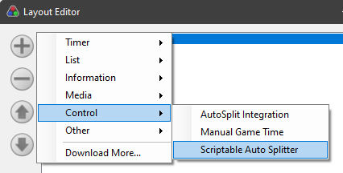
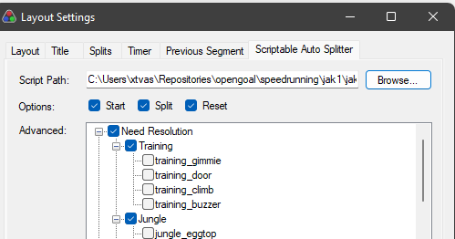

# OpenGOAL Speedrunnning Tools

This repository is for speedrunning related tools, scripts and assets.

For example, LiveSplit auto splitter scripts.

## Developing / Testing the ASL scripts

> Do not move the `.asl` files around or rename them -- they are wired up to LiveSplit by their XML - https://github.com/LiveSplit/LiveSplit.AutoSplitters

First, make sure you are using the latest OpenGOAL.

<!-- TODO - document how to add a new flag -->

Add the following component to your layout:

Then browse for the ASL file:

Everytime you save the file, it will automatically load.

Unfortunately reading logs, especially compile errors is a bit difficult:
- For viewing normal event logs (not compile errors) use https://docs.microsoft.com/en-us/sysinternals/downloads/debugview
- For viewing compile errors you will need to go into Event Viewer > Application Logs
